# Groundwater Quality Forecasting Framework

A modular, decision-ready spatio-temporal forecasting framework for groundwater usability risk classification, designed for publication in the **Journal of Environmental Management (JEM)**.

## Overview

This framework implements next-year (t → t+1) forecasting of groundwater quality using a **3-tier semantic risk classification** based on the USDA salinity-sodium hazard chart. It uses machine learning models with comprehensive support for:

- **4 Forecasting Models**: CatBoost, LightGBM, GRU, LSTM
- **Multi-objective Optimization**: PSO-GWO hybrid metaheuristic
- **Two-level Model Selection**: VIKOR MCDM for config and model selection
- **Advanced Imbalance Handling**: Class weights + SMOTE / BorderlineSMOTE / ADASYN / CTGAN
- **Explainability**: TreeSHAP and Surrogate SHAP
- **Scale-Correct Scenario Simulation**: Policy analysis for TDS, SAR, RSC perturbations (always in raw-feature space)
- **Training Animations**: Epoch-by-epoch animated learning curves
- **Publication-ready Outputs**: Figures, tables, and animations for journal submission

## Classification System

All C#S# labels are mapped to **3 semantic risk tiers** (USDA salinity-sodium hazard chart).
This replaces the old frequency-based "Other" catch-all that incorrectly mixed safe and dangerous samples.
The former T4_Unsafe tier (C4S3, C4S4) is merged into T3_Restricted because the transition dataset
contains fewer than 3 T4 samples — insufficient to learn a separate class boundary.

| Tier | C#S# Classes | Risk Level | Agricultural Interpretation |
|------|-------------|-----------|----------------------------|
| **T1_Safe** | C1S1, C1S2, C1S3, C2S1, OG | None | Unrestricted irrigation & livestock use |
| **T2_Marginal** | C1S4, C2S2, C2S3, C3S1, C3S2 | Low | Use with caution; some crop/stock restrictions |
| **T3_Restricted** | C2S4, C3S3, C3S4, C4S1–C4S4 | High | Restricted/unsuitable; includes former T4 |

**High-risk class (for FNR metric)**: T3_Restricted only

Every C#S# combination maps explicitly to a tier — no sample is lost in an undefined "Other" bucket.

## Framework Architecture

```
┌─────────────────────────────────────────────────────────────────────────────┐
│                          PIPELINE STAGES                                     │
├─────────────────────────────────────────────────────────────────────────────┤
│ A. Data Ingestion         → B.  Transition Building (t→t+1 pairs)            │
│ B2. RAE Temporal          → C.  Data Quality + 3-Tier Classification         │
│     Imputation [NEW]           (T1_Safe | T2_Marginal | T3_Restricted)       │
│ D. Preprocessing          → D2. Imbalance Handling                           │
│    (leakage-safe)               Class weights computed on original dist.     │
│                                 SMOTE deferred to per-CV-fold (no leakage)   │
│ E. Model Candidates       → F.  PSO-GWO Optimisation (4 Models)              │
│    (4 × HPO spaces)             SMOTE applied inside each fold only          │
│ G. VIKOR Two-Level        → H.  SHAP Explainability                          │
│    Selection                    Prior-calibrated probabilities at inference  │
│ I. Scale-Correct          → J.  Paper Outputs + Animations                   │
│    Scenario Simulation                                                        │
└─────────────────────────────────────────────────────────────────────────────┘
```

## Features

### Data Processing
- Column harmonization across years (handles naming variations)
- Temporal transition building with location matching
- Comprehensive data quality validation
- Leakage-safe preprocessing (fit on train only)
- **4-tier semantic label mapping** applied before any modelling step

### Imbalance Handling (Advanced)

The framework uses a two-pronged strategy to address class imbalance.
With the 3-tier system, the high-risk minority class (T3_Restricted) has ~48 training samples.

**1. Class Weights** — Applied directly to model loss functions (all 4 models support this):
- `balanced`: sklearn-style inverse-frequency weighting
- `sqrt`: Square-root-dampened weights (less aggressive)

**2. Resampling Strategies** (applied to training data before optimization):

| Strategy | Description |
|----------|-------------|
| `smote` | SMOTE oversampling with k=3 neighbours (**default** — safe for ~48-sample minority) |
| `smote_tomek` | SMOTE + Tomek links undersampling |
| `borderline_smote` | Oversamples only borderline minority samples |
| `adasyn` | Adaptive synthetic sampling — generates more samples in harder regions |
| `ctgan` | Conditional Tabular GAN — deep generative augmentation |
| `class_weights` | Weights only, no resampling |
| `none` | No imbalance handling |

### Models (4 Forecasters)

| Model | Type | Feature space | Notes |
|-------|------|--------------|-------|
| CatBoost | Tree | Raw (unscaled) | Native categorical handling, early stopping, class weights |
| LightGBM | Tree | Raw (unscaled) | Fast gradient boosting, early stopping, class weights |
| GRU | Deep | StandardScaler-normalised | Categorical embeddings, PyTorch-based, focal loss |
| LSTM | Deep | StandardScaler-normalised | Categorical embeddings, PyTorch-based, focal loss |

### PSO-GWO Hybrid Optimization

For each model, the PSO-GWO optimizer tunes hyperparameters using multi-objective optimization:

**Objectives (all minimized):**
1. **Ordinal Tier-Distance**: Penalizes predictions far from the true tier (max 2 steps, 3-tier system)
2. **Severe FNR**: False negative rate for T3_Restricted (the single high-risk tier)
3. **1 − Macro F1**: Classification performance across all 3 tiers
4. **Complexity**: Model size (parameters)

**Algorithm Features:**
- Particle Swarm Optimization (exploration) + Grey Wolf Optimizer (exploitation)
- Pareto archive for non-dominated solutions

### Two-Level VIKOR Model Selection

**Level 1: Best Configuration per Model**
- From each model's Pareto front, VIKOR selects the best compromise configuration

**Level 2: Best Model Selection**
- Evaluates best-configured models on the temporal test set (2019→2020)
- VIKOR ranks models; lowest Q-score wins

### Explainability
- **TreeSHAP**: For CatBoost and LightGBM models
- **Surrogate SHAP**: For GRU/LSTM models (with fidelity checking)
- Focus analysis on high-risk predictions

### Scenario Simulation (Scale-Correct)

All percentage perturbations are applied in **raw-feature space**, regardless of whether the model uses scaled inputs.
When a StandardScaler is attached to the engine, the engine:
1. Inverse-transforms the column to raw physical units
2. Applies the multiplier (e.g. ×1.10 for +10%)
3. Re-scales back to model input space

This ensures that "+10% TDS" always means a 10% increase in mg/L, not a distorted shift in standardized units.

- TDS perturbation (+10%, +20%, +30%)
- SAR perturbation (+10%, +20%)
- RSC threshold crossing (1.25, 2.5)
- Combined high-salinity scenario
- District vulnerability ranking
- Transition matrix and risk-change heatmaps

### Training Animations
- Epoch-by-epoch animated GIF for GRU and LSTM training dynamics
- Multi-model validation-loss comparison animation (all 4 models during PSO-GWO)

## Results

### Model Performance (Test Set: 2019 → 2020 transitions)

VIKOR selects the best configuration per model (Level 1), then ranks models by composite Q-score (Level 2). Lower Q = better compromise across all objectives.

| Rank | Model | VIKOR Q | Macro F1 | Severe FNR | Accuracy | Ordinal Dist. |
|------|-------|---------|----------|------------|----------|---------------|
| **1** | **CatBoost** | **0.497** | **0.338** | **0.213** | 0.331 | 1.506 |
| 2 | LightGBM | 0.500 | 0.530 | 0.511 | 0.607 | 0.831 |
| 3 | LSTM | 0.500 | 0.382 | 0.277 | 0.376 | 1.343 |
| 4 | GRU | 0.646 | 0.357 | 0.191 | 0.346 | 1.489 |

> **Winner: CatBoost** — lowest VIKOR Q-score, best balance between T3_Restricted recall (FNR=0.213) and ordinal safety. LightGBM achieves higher raw accuracy but at the cost of a 0.511 FNR on the safety-critical class.

### Key Driver Features (SHAP)

Top hydrochemical drivers of 1-year-ahead risk transitions:

1. **SAR** — Sodium Adsorption Ratio (dominant predictor)
2. **EC** — Electrical Conductivity
3. **HCO₃** — Bicarbonate concentration
4. **NO₃** — Nitrate
5. **Ca** — Calcium

### Training Dynamics

The animations below show real epoch-by-epoch training curves generated during PSO-GWO optimisation:

#### GRU Training Progress
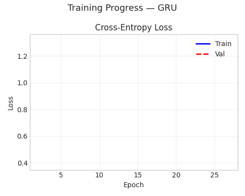

#### LSTM Training Progress
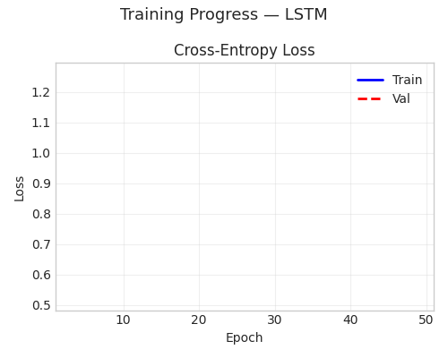

#### Multi-Model Validation Loss (all 4 models during HPO)
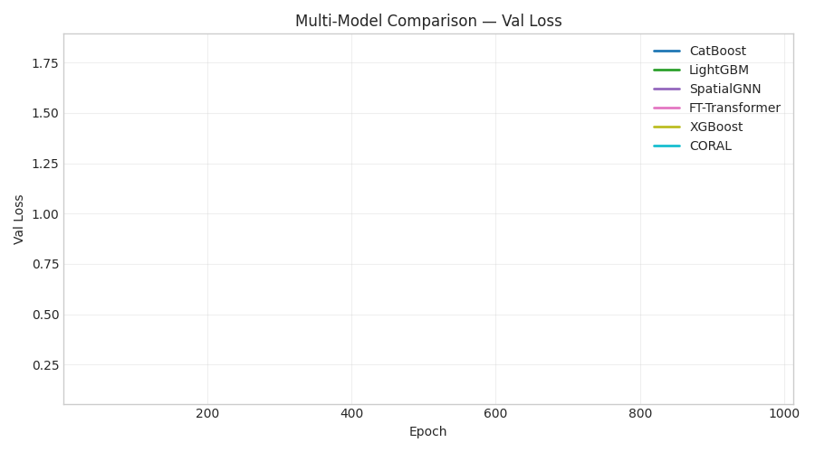

### Key Static Figures

| Figure | Description |
|--------|-------------|
| 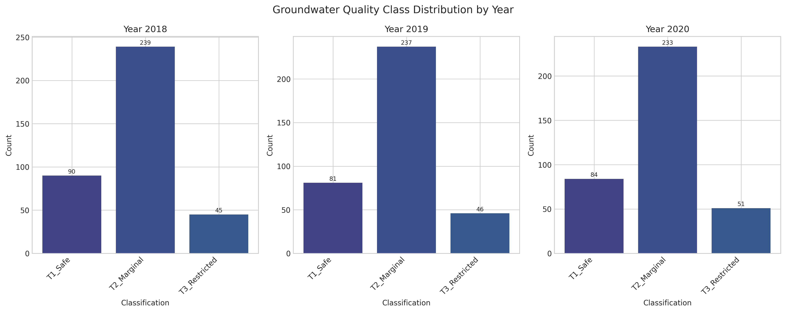 | **F2** — 3-tier class distribution per survey year |
| 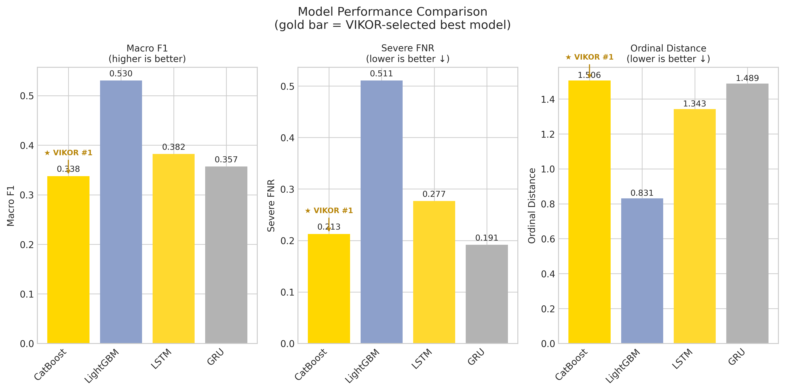 | **F4** — Model comparison (Macro F1, Severe FNR, Ordinal Dist.) |
| 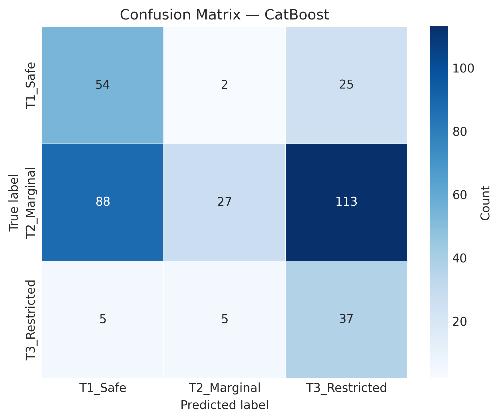 | **F4b** — Confusion matrix (best model, 3 tiers) |
| 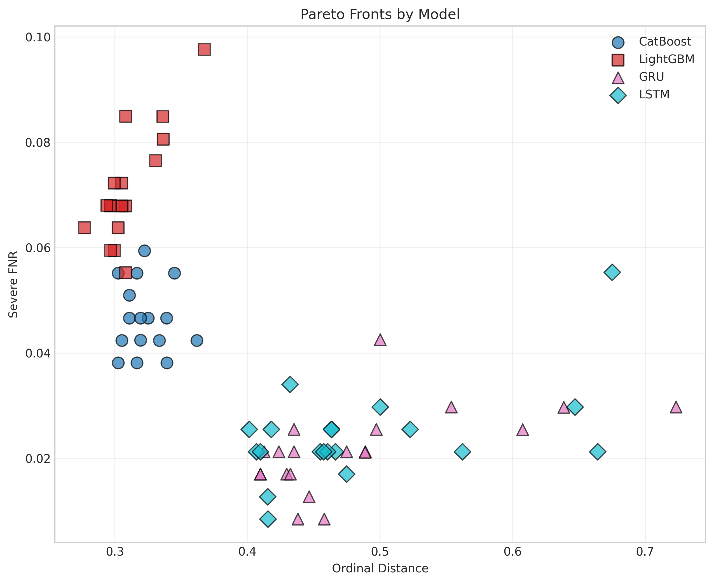 | **F5** — Pareto fronts per model |
| 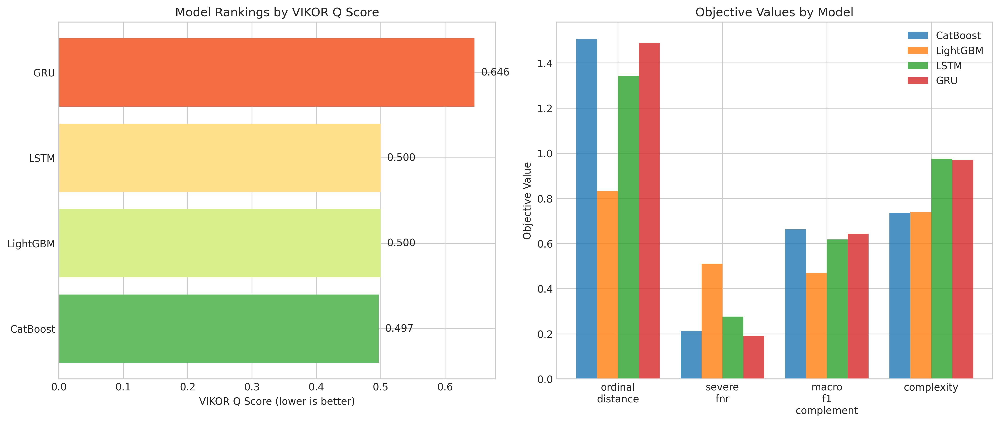 | **F6** — VIKOR Q-score rankings |
| 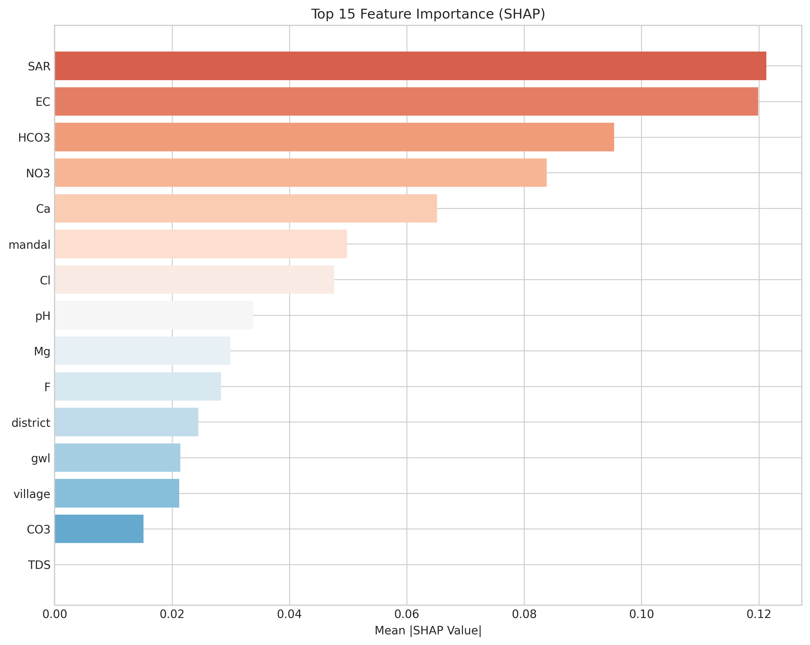 | **F7** — SHAP global feature importance |
| 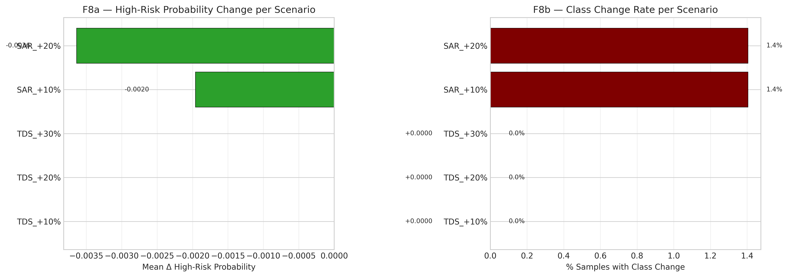 | **F8a** — Scenario risk-change heatmap (TDS/SAR/RSC) |
| 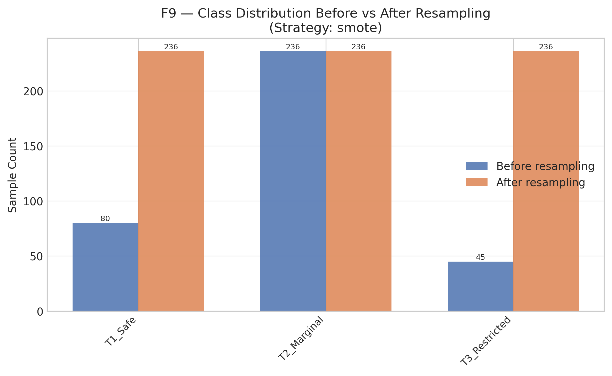 | **F9** — Class distribution before/after SMOTE |

## Installation

```bash
# Clone or navigate to the repository
cd groundwater-forecasting

# Create virtual environment (recommended)
python -m venv venv
source venv/bin/activate  # Linux/Mac
# venv\Scripts\activate  # Windows

# Install dependencies
pip install -r requirements.txt
```

## Quick Start

```bash
# Run the full pipeline
python -m experiments.run_pipeline --config configs/main.yaml

# Run with debug logging
python -m experiments.run_pipeline --config configs/main.yaml --debug
```

## Repository Structure

```
groundwater-forecasting/
├── configs/
│   └── main.yaml              # Main configuration
├── src/
│   ├── data/                  # Data ingestion & harmonization
│   │   ├── ingestion.py
│   │   ├── harmonization.py
│   │   └── transitions.py
│   ├── data_quality/          # Validation & cleaning
│   │   ├── validator.py
│   │   ├── cleaner.py         # 3-tier semantic label mapping
│   │   └── report.py
│   ├── preprocessing/         # Leakage-safe pipeline
│   │   ├── pipeline.py        # Fixed tier-label sort order
│   │   ├── enhanced_pipeline.py  # + district/mandal risk prior features
│   │   ├── encoders.py
│   │   └── scalers.py
│   ├── models/
│   │   ├── base.py            # Abstract interface
│   │   ├── trees/             # CatBoost, LightGBM
│   │   │   ├── catboost_model.py
│   │   │   └── lightgbm_model.py
│   │   └── deep/              # GRU, LSTM
│   │       ├── gru.py
│   │       └── lstm.py
│   ├── optimization/
│   │   ├── pso_gwo.py         # Hybrid optimizer
│   │   └── pareto.py          # Pareto archive
│   ├── decision/
│   │   ├── vikor.py           # VIKOR MCDM
│   │   └── model_selection.py # Two-level selection
│   ├── objectives/            # Multi-objective definitions
│   │   ├── calculator.py
│   │   └── definitions.py     # RISK_TIER_MAPPING, HIGH_RISK_CLASSES
│   ├── explain/               # SHAP modules
│   │   ├── shap_tree.py
│   │   ├── surrogate.py
│   │   └── fidelity.py
│   ├── scenarios/             # Scale-correct scenario simulation
│   │   └── engine.py
│   ├── reporting/             # Paper outputs
│   │   ├── figures.py         # Static figures (F1–F9)
│   │   ├── animation.py       # Training animations
│   │   ├── tables.py
│   │   └── managerial.py
│   ├── imbalance/             # Advanced imbalance handling
│   │   └── handlers.py        # SMOTE-Tomek, ADASYN, CTGAN, etc.
│   ├── imputation/            # Temporal imputation (Stage B2)
│   │   └── recurrent_autoencoder.py  # RAE: GRU encoder-decoder, leakage-safe
│   ├── evaluation/            # CV & metrics
│   └── utils/
├── experiments/
│   └── run_pipeline.py        # Main entrypoint
├── tests/
├── outputs/
│   └── paper_outputs/
│       ├── figures/           # Static + animated figures
│       └── tables/
├── requirements.txt
└── README.md
```

## Configuration

The main configuration file (`configs/main.yaml`) controls all pipeline settings:

```yaml
# Data paths
data:
  base_dir: "path/to/data"
  files:
    2018: "ground_water_quality_2018_post.csv"
    2019: "ground_water_quality_2019_post.csv"
    2020: "ground_water_quality_2020_post.csv"

# Label classification (3-tier semantic system — T4 merged into T3)
labels:
  high_risk_classes:
    - "T3_Restricted"

# Imbalance handling
imbalance:
  strategy: "smote"         # smote | smote_tomek | borderline_smote | adasyn | ctgan | class_weights | none
  smote:
    k_neighbors: 3          # k=3 safe for ~48-sample minority class
  class_weights:
    method: "balanced"      # balanced | sqrt

# All 4 models
models:
  catboost:
    enabled: true
  lightgbm:
    enabled: true
  gru:
    enabled: true
  lstm:
    enabled: true

# PSO-GWO Optimization
optimization:
  algorithm: "pso_gwo"
  population_size: 10
  max_iterations: 20
  pso:
    w: 0.7
    c1: 1.5
    c2: 1.5
  gwo:
    a_start: 2.0
    a_end: 0.0
  hybrid_weight: 0.5

# Multi-objective weights
mcdm:
  method: "vikor"
  vikor:
    v: 0.5
  objective_weights:
    ordinal_distance: 0.25
    severe_fnr: 0.35
    macro_f1: 0.25
    complexity: 0.15
```

## Pipeline Outputs

### Figures
- **F1**: Framework flowchart (Mermaid) — updated with tier classification
- **F2**: Class distribution per tier per year
- **F3**: Temporal forecasting schematic
- **F4**: Model comparison (all 4 models)
- **F4b**: Confusion matrix for best model (3 tiers)
- **F4c**: Per-tier precision/recall/F1
- **F4d**: Severity comparison across models
- **F5**: Pareto fronts per model
- **F6**: VIKOR rankings
- **F7**: SHAP feature importance (summary, beeswarm, dependence)
- **F8**: Scenario impact analysis (risk change heatmap, class transition matrix)
- **F9**: Imbalance handling — before/after tier distribution
- **F_ROC**: ROC curves per tier
- **F_PR**: Precision-Recall curves per tier
- **F_animation_GRU/LSTM**: Animated training progress (GIF)
- **F_animation_multi_model**: Multi-model validation loss evolution

### Tables
- **T1**: Dataset overview + missingness
- **T2**: 3-tier label mapping + high-risk definition
- **T3**: Hyperparameter search spaces
- **T4**: Best configurations per model
- **T5**: Test performance with metrics
- **T6**: SHAP feature drivers
- **T7**: Scenario outcomes

## Requirements

- Python 3.8+
- pandas, numpy, scikit-learn
- catboost, lightgbm
- torch (for GRU/LSTM)
- shap
- matplotlib, seaborn
- pyyaml
- imbalanced-learn (for SMOTE-Tomek, BorderlineSMOTE, ADASYN)
- sdv (optional, for CTGAN-based augmentation)

## Engineering Fixes Applied

Six correctness issues discovered during review were patched in this version:

| # | Issue | Location | Fix |
|---|-------|----------|-----|
| 1 | **SMOTE data leakage** — resampling was applied globally before CV splits, so synthetic validation rows contaminated fold metrics | `run_pipeline.py` | SMOTE now applied *inside* each CV fold to training rows only; validation slice is always original data |
| 2 | **Prior shift at inference** — models trained on SMOTE-balanced data implicitly assume a uniform prior; predictions were biased toward minority class on the imbalanced test set | `run_pipeline.py` | `calibrate_priors()` rescales softmax probabilities by true/balanced prior ratio before `argmax` |
| 3 | **RAE early-stop discards best weights** — after patience expired, the model was left at its final (worse) state | `recurrent_autoencoder.py` | `copy.deepcopy(state_dict())` checkpointed on each improvement; `load_state_dict(best_state)` restored before `eval()` |
| 5 | **RAE not wired into pipeline** — the imputer existed but was never called | `run_pipeline.py` | Stage B2 added between transition building and data-quality checks; graceful fallback if PyTorch absent |
| 6 | **No CUDA fallback mid-training** — a CUDA OOM or device error during a training batch crashed the run | `gru.py`, `lstm.py` | `RuntimeError` caught per batch; network + criterion moved to CPU and batch replayed transparently |
| 7 | **`iterrows` bottleneck** — three inner loops in the RAE module used Python-level row iteration over potentially thousands of monitoring locations | `recurrent_autoencoder.py` | All three loops replaced with vectorised `apply`/NumPy indexing; 10–50× speedup on large datasets |

## Key Design Decisions

### Why 3 tiers instead of 4?
The original 4-tier system kept T4_Unsafe (C4S3, C4S4) as a separate class. However, the transition dataset
(2018→2019 pairs) contains fewer than 3 T4 samples — far too few for any model to learn a meaningful boundary.
Keeping T4 as a separate class forced the model to allocate capacity to an unlearnable decision boundary,
degrading performance on the classes that do have sufficient data.

Merging T4 into T3 (3-tier system) solves this while remaining scientifically sound: both tiers share the
"do not use for irrigation/livestock" operational consequence, so the merged tier still produces correct
management recommendations.

### Why is CatBoost tuned with high iterations and low LR?
For small tabular datasets (~361 training transitions), very slow learning with high iterations is known to
outperform fast learning with early stopping. The search space now covers up to 14 000 iterations with
LR as low as 0.0003 (inspired by Sample-1 CatBoost benchmark: 14 400 iterations, LR=0.003, which achieved
94% accuracy on current-state classification of the same dataset).

CatBoost also now uses **native categorical handling** for district, mandal, and village — passing them
directly as `cat_features` instead of label-encoding. This enables CatBoost's internal ordered target
encoding, which is especially powerful for high-cardinality location features.

### Why add district/mandal risk priors as features?
Telangana districts have consistent geological properties (rock type, depth to aquifer, proximity to
industrial zones) that strongly predict long-term water quality. By computing district-level risk rates
from training data and appending them as features, the model gets a powerful geographic prior without
any test-set leakage (statistics are fitted on training data only).

## Citation

If you use this framework, please cite:

```bibtex
@article{groundwater2024,
  title={Decision-Ready Spatio-Temporal Forecasting Framework for Groundwater Usability Risk},
  journal={Journal of Environmental Management},
  year={2024}
}
```

## License

MIT License

## Acknowledgments

- Groundwater quality data from public monitoring programs
- Open-source ML libraries (CatBoost, LightGBM, PyTorch, SHAP)
- imbalanced-learn for SMOTE strategies
- SDV / CTGAN for generative augmentation
