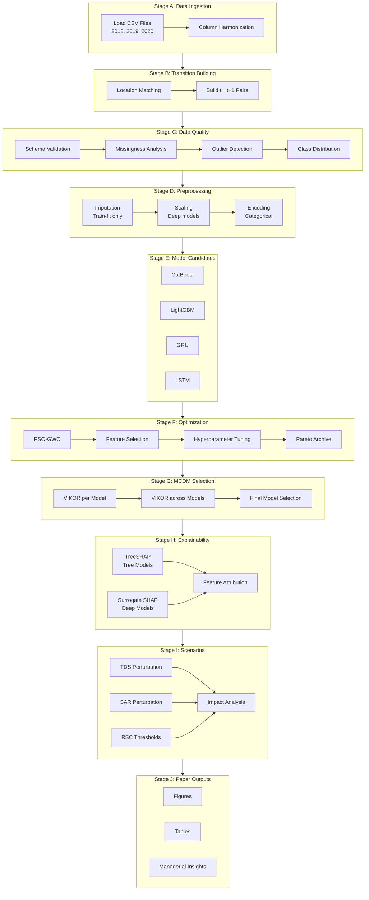

```mermaid
flowchart TB
    subgraph Stage_A["Stage A: Data Ingestion"]
        A1[Load CSV Files<br>2018, 2019, 2020]
        A2[Column Harmonization]
        A1 --> A2
    end

    subgraph Stage_B["Stage B: Transition Building"]
        B1[Location Matching]
        B2[Build t→t+1 Pairs]
        B1 --> B2
    end

    subgraph Stage_C["Stage C: Data Quality"]
        C1[Schema Validation]
        C2[Missingness Analysis]
        C3[Outlier Detection]
        C4[Class Distribution]
        C1 --> C2 --> C3 --> C4
    end

    subgraph Stage_D["Stage D: Preprocessing"]
        D1[Imputation<br>Train-fit only]
        D2[Scaling<br>Deep models]
        D3[Encoding<br>Categorical]
        D1 --> D2 --> D3
    end

    subgraph Stage_E["Stage E: Model Candidates"]
        E1[CatBoost]
        E2[LightGBM]
        E3[GRU]
        E4[LSTM]
    end

    subgraph Stage_F["Stage F: Optimization"]
        F1[PSO-GWO]
        F2[Feature Selection]
        F3[Hyperparameter Tuning]
        F4[Pareto Archive]
        F1 --> F2 --> F3 --> F4
    end

    subgraph Stage_G["Stage G: MCDM Selection"]
        G1[VIKOR per Model]
        G2[VIKOR across Models]
        G3[Final Model Selection]
        G1 --> G2 --> G3
    end

    subgraph Stage_H["Stage H: Explainability"]
        H1[TreeSHAP<br>Tree Models]
        H2[Surrogate SHAP<br>Deep Models]
        H3[Feature Attribution]
        H1 --> H3
        H2 --> H3
    end

    subgraph Stage_I["Stage I: Scenarios"]
        I1[TDS Perturbation]
        I2[SAR Perturbation]
        I3[RSC Thresholds]
        I4[Impact Analysis]
        I1 & I2 & I3 --> I4
    end

    subgraph Stage_J["Stage J: Paper Outputs"]
        J1[Figures]
        J2[Tables]
        J3[Managerial Insights]
    end

    Stage_A --> Stage_B --> Stage_C --> Stage_D
    Stage_D --> Stage_E
    Stage_E --> Stage_F --> Stage_G
    Stage_G --> Stage_H --> Stage_I --> Stage_J
```
